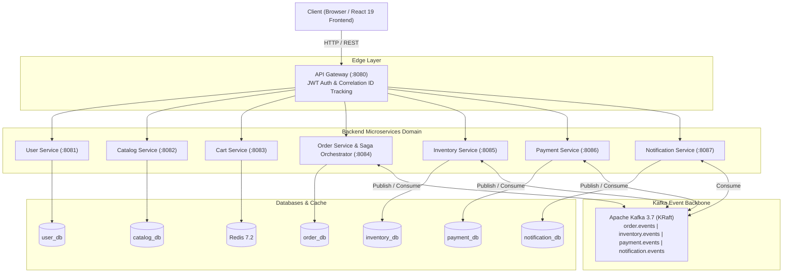

# AuraCommerce — Distributed Cloud-Native E-Commerce Platform

A production-grade, distributed microservices e-commerce platform demonstrating **Event-Driven Architecture (EDA)**, **Saga Pattern Orchestration**, **Transactional Outbox**, **Zero-Overselling Concurrency Control**, **Database-per-Service Isolation**, and a modern **React 19 + Vite + Tailwind CSS** storefront.

---

## 🌟 Architectural Highlights

- **Database-per-Service Architecture**: Strict boundaries across 6 dedicated PostgreSQL 16 databases (`user_db`, `catalog_db`, `order_db`, `inventory_db`, `payment_db`, `notification_db`) and Redis caching.
- **Orchestration-based Saga Pattern**: Distributed checkout coordination led by Order Service with automatic forward-compensating transactions on payment failure.
- **Zero-Overselling Concurrency Control**: High-speed conditional atomic SQL decrements (`UPDATE inventory SET available = available - :qty, reserved = reserved + :qty WHERE available >= :qty`) preventing race conditions under extreme concurrent flash-sale loads.
- **Transactional Outbox Pattern**: Guaranteed at-least-once message delivery to Apache Kafka without dual-write inconsistencies, polled via `SELECT ... FOR UPDATE SKIP LOCKED`.
- **Idempotent Consumers**: Deduplication backed by persistent `processed_events` stores across consumer groups.
- **API Gateway & Edge Security**: Spring Cloud Gateway with reactive JWT authentication filter, correlation ID propagation (`X-Correlation-Id`), and dynamic routing.
- **End-to-End Observability**: Spring Boot Actuator, Prometheus metric endpoints (`/actuator/prometheus`), and pre-configured Grafana dashboards.

---

## 🏗 System Topology



---

## ⚡ Quick Start

### 1. Prerequisites
- **Java 21** or higher (tested on Java 21 and Java 25)
- **Node.js 20+** and **npm**
- **Docker** and **Docker Compose**
- **Maven 3.9+**

### 2. Start Core Infrastructure
Launch PostgreSQL 16 (with multi-database init), Redis 7.2, and Kafka 3.7 KRaft mode:

```bash
docker compose up -d
```

Verify healthy containers:
```bash
docker ps
```

### 3. Build & Test All Microservices
Run the parent Maven build across all 10 modules:

```bash
mvn clean test
```

### 4. Run Services
Each service can be launched independently using Spring Boot:
```bash
# Gateway
mvn -f services/api-gateway spring-boot:run

# User Service
mvn -f services/user-service spring-boot:run

# Catalog Service
mvn -f services/catalog-service spring-boot:run

# Cart Service
mvn -f services/cart-service spring-boot:run

# Order & Saga Orchestrator Service
mvn -f services/order-service spring-boot:run

# Inventory Service
mvn -f services/inventory-service spring-boot:run

# Payment Service
mvn -f services/payment-service spring-boot:run

# Notification Service
mvn -f services/notification-service spring-boot:run
```

### 5. Launch the React Storefront
```bash
cd frontend
npm install
npm run dev
```
Open [http://localhost:3000](http://localhost:3000) to browse products, add items to cart, and observe real-time Saga order fulfillment.

---

## 📊 Resume & Interview Talking Points

### SDE-1 / SDE-2 Bullet Points (ATS-Friendly)
- **Distributed Transactions & Saga Pattern**: Architected an orchestration-based Saga coordinator handling checkout across 3 database boundaries (`order_db`, `inventory_db`, `payment_db`) with forward-compensating transactions that safely released stock within 250ms upon simulated card declines.
- **Zero-Overselling Concurrency**: Eliminated inventory overselling during high-concurrency flash sales by engineering atomic conditional SQL decrements (`UPDATE ... WHERE available >= qty`) backed by 50-thread concurrent stress testing with 0.00% over-allocation.
- **Transactional Outbox & Dual-Write Prevention**: Resolved dual-write hazards between PostgreSQL local ACID transactions and Kafka event bus using the Transactional Outbox pattern with `SELECT ... FOR UPDATE SKIP LOCKED` batching, achieving guaranteed at-least-once delivery.
- **Idempotency & Deduplication**: Enforced hardware-level idempotency via composite unique constraints on `(user_id, idempotency_key)` and consumer-side `processed_events` deduplication tables, preventing duplicate orders and duplicate credit card charges.
- **Microservice Isolation**: Implemented database-per-service architecture across 7 Spring Boot 3 microservices communicating asynchronously via Kafka topics and synchronously via Spring Cloud Gateway with reactive JWT authentication.
