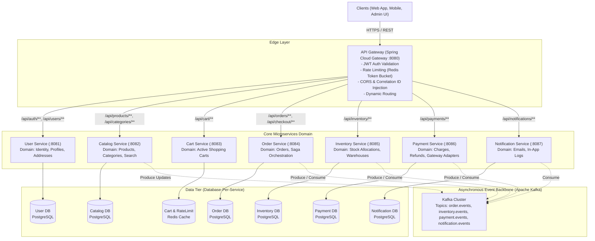
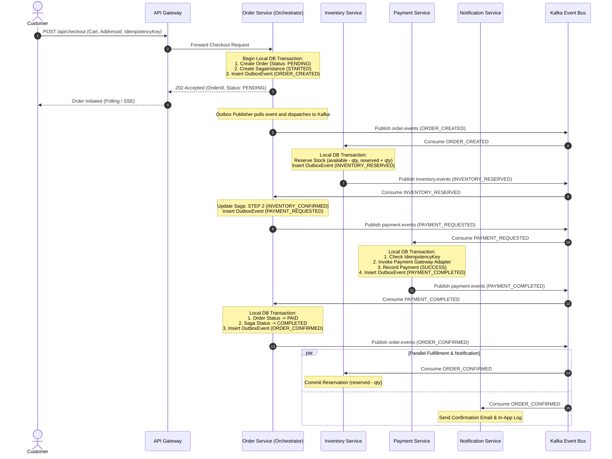
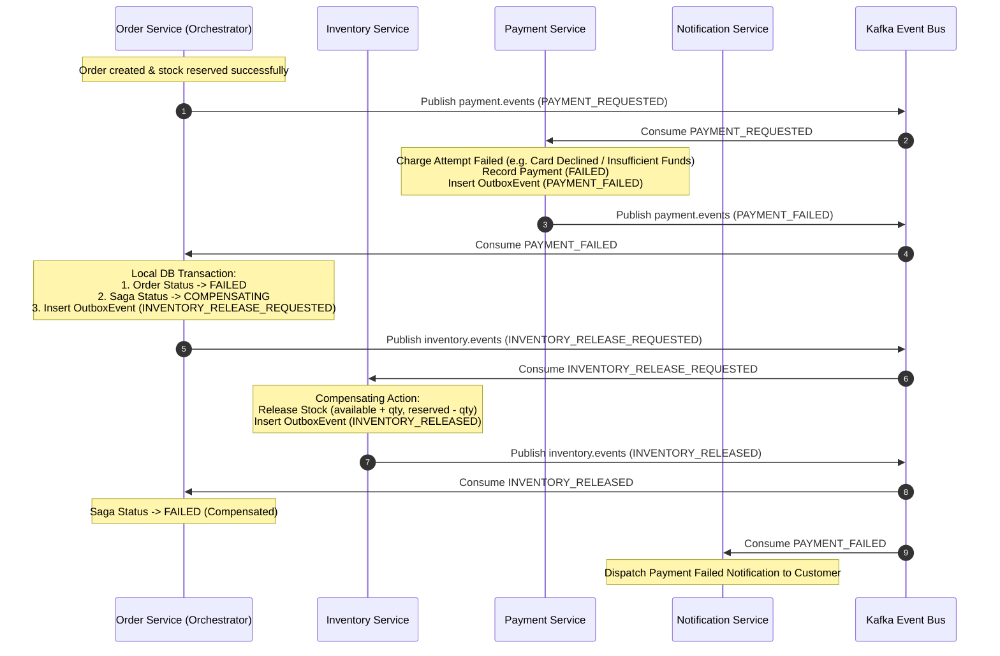
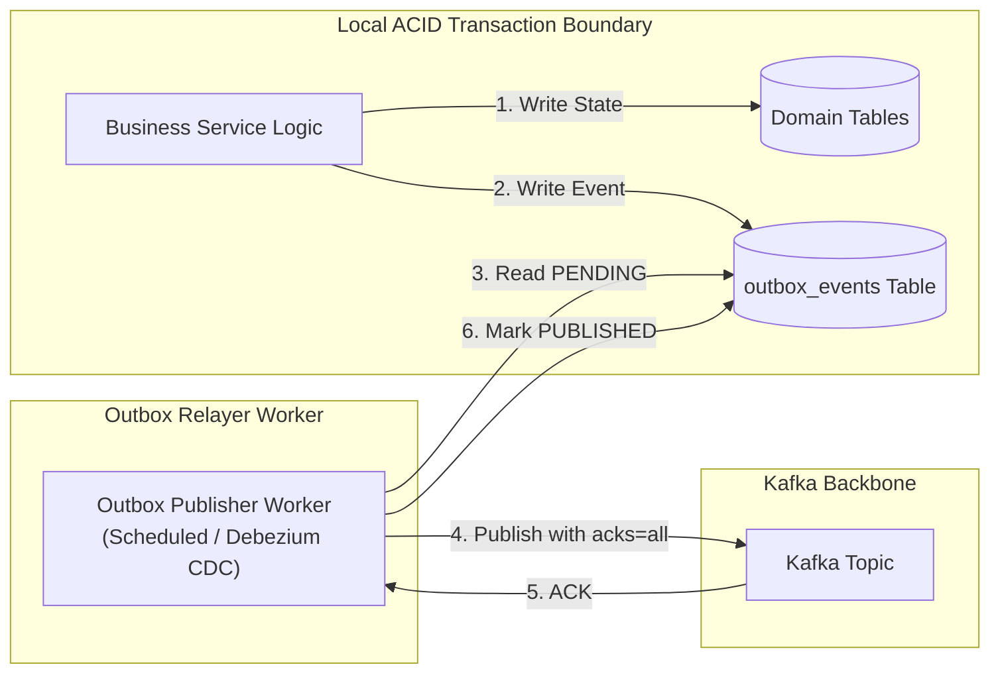
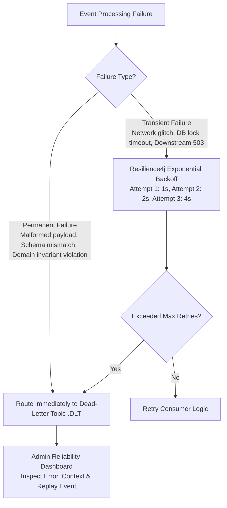

# Phase 1: Distributed E-Commerce Architecture & System Design Specification

## 1. Executive Summary & Product Vision

This document establishes the architectural blueprint for an enterprise-grade, distributed e-commerce microservices platform. The system is designed to provide high availability, resilient transactional workflows, and strict data consistency under high concurrency (e.g., flash sales and high-traffic checkouts).

The system balances user experience (instant browsing, sub-50ms catalog lookups via multi-layer caching) with strict transactional correctness (zero overselling, exactly-once payment semantics, resilient Saga-based order fulfillment, and transactional outbox event publishing).

---

## 2. Requirements Engineering

### 2.1 Functional Requirements (FR)

#### Customer Capabilities
- **Authentication & Identity**: User registration, login with JWT access tokens and rotating refresh tokens, profile management, and multiple shipping addresses.
- **Product Catalog Discovery**: Full-text keyword search (name, brand, description, SKU), faceted filtering (category, price range, brand, stock availability, ratings), multi-criteria sorting (price asc/desc, popularity, newest), and category hierarchies.
- **Cart Management**: High-speed shopping cart operations (add, update quantity, remove, clear, auto-expiry TTL) backed by Redis with database persistence fallback.
- **Resilient Checkout**: Multi-step checkout pipeline: address validation, stock pre-validation, order creation, inventory reservation, payment processing, order confirmation, and notification delivery.
- **Order Lifecycle & Tracking**: Visual tracking timeline (Pending $\to$ Payment Pending $\to$ Paid $\to$ Processing $\to$ Shipped $\to$ Delivered), order history lookup, cancellation of eligible orders, and automated refund workflows.
- **Notifications**: Real-time event notifications for order lifecycle milestones (email dispatch simulation and in-app event log).

#### Administrator Capabilities
- **Product & Category Administration**: CRUD operations for products, SKU management, pricing adjustments, image galleries, and category taxonomy.
- **Inventory Control**: Real-time stock adjustment, warehouse-level tracking, low-stock threshold alerting, and safety stock rules.
- **Order Management**: Fulfillment status progression, manual order cancellation, refund triggers, and customer lookup.
- **Event & Reliability Operations**: Live Kafka dead-letter queue (DLQ) inspection, transactional outbox status monitoring, and controlled event replay mechanisms.
- **Operational Metrics**: Real-time sales telemetry, order conversion rates, payment failure breakdown, and service health status.

---

### 2.2 Non-Functional Requirements (NFR) & SLO Targets

| Metric | Target / SLA | Architectural Strategy |
| :--- | :--- | :--- |
| **Availability** | 99.95% uptime for core browsing/checkout | Stateless services, health check probes, redundancy |
| **Read Latency (P99)** | $< 50\text{ ms}$ for catalog & product details | Redis read-through cache, PostgreSQL B-tree & GIN indexing |
| **Write Latency (P99)** | $< 350\text{ ms}$ for order placement & checkout | Asynchronous Saga execution, non-blocking Kafka messaging |
| **Inventory Integrity** | $0$ overselling under concurrent requests | Atomic conditional SQL decrements + versioned row locking |
| **Payment Idempotency** | Exactly-once payment execution | Client Idempotency-Key + database unique constraint |
| **Event Reliability** | At-least-once with idempotent deduplication | Transactional Outbox Pattern + Consumer Processed Event Store |
| **Scalability Target** | Designed for baseline $10\text{K}$ orders/day; evolvable to $1\text{M}+$ | Partitioned Kafka topics, read replicas, stateless gateways |

---

## 3. Microservices Decomposition & Service Boundaries

Following Domain-Driven Design (DDD) principles, the system is decomposed into discrete bounded contexts. Each service encapsulates its business logic, aggregates, and persistence tier.



### 3.1 Bounded Context Definitions

1. **Identity & Access Management (User Service)**
   - *Aggregates*: `User`, `Address`, `RefreshToken`.
   - *Responsibilities*: Password hashing (BCrypt), JWT issuance and rotation, role-based access control (`ROLE_CUSTOMER`, `ROLE_ADMIN`), user address book.
   
2. **Product Catalog & Discovery (Catalog Service)**
   - *Aggregates*: `Product`, `Category`.
   - *Responsibilities*: Product hierarchy, SKU management, search query execution, pricing metadata, multi-attribute filtering.
   
3. **Shopping Cart Context (Cart Service)**
   - *Aggregates*: `Cart`, `CartItem`.
   - *Responsibilities*: Ephemeral cart state, fast item addition/removal, Redis hash storage with TTL, price snapshotting. Note: Final checkout re-validates catalog prices synchronously to prevent cart price tampering.

4. **Order Management & Saga Orchestration (Order Service)**
   - *Aggregates*: `Order`, `OrderItem`, `SagaInstance`, `OutboxEvent`.
   - *Responsibilities*: Order lifecycle state machine, checkout orchestration, compensating transaction dispatch, transactional outbox record creation.

5. **Inventory & Stock Fulfillment (Inventory Service)**
   - *Aggregates*: `Inventory`, `InventoryReservation`, `OutboxEvent`.
   - *Responsibilities*: Atomic stock reservation, stock release on payment abort, stock commitment on order settlement, concurrency control to eliminate overselling.

6. **Payment & Settlement (Payment Service)**
   - *Aggregates*: `Payment`, `Refund`, `IdempotencyRecord`, `OutboxEvent`.
   - *Responsibilities*: Payment provider abstraction (`MockPaymentProvider` with deterministic success/failure/timeout simulation), idempotency key validation, transactional outbox record creation.

7. **Notification & Customer Engagement (Notification Service)**
   - *Aggregates*: `NotificationLog`.
   - *Responsibilities*: Asynchronous event consumer, format templates (Order Confirmation, Payment Failed, Order Shipped, Refund Issued), audit log persistence.

---

## 4. Database-Per-Service: Architecture & Tradeoff Analysis

### Why Shared Databases Are Anti-Patterns in Microservices
1. **Tight Coupling at Schema Level**: In a monolithic DB, altering a column (e.g., `orders.status` or `users.email`) risks breaking unrelated queries and services.
2. **Hidden Direct SQL Joins**: Services start querying each other's tables directly, bypassing domain validation rules and invariants.
3. **No Autonomous Deployment**: Independent schema migrations via Flyway/Liquibase become impossible without complex global locks and coordination.
4. **Single Point of Failure (SPOF)**: A connection pool leak or table lock in the catalog service can take down checkout and payments.
5. **Incompatible Scaling Profiles**: Catalog browsing has a 95:5 read-to-write ratio, whereas Order and Inventory services experience high write-lock contention. Polyglot configurations (e.g., Redis for carts, read replicas for catalog) cannot be tailored per service.

### Database Ownership Matrix

| Microservice | Data Store | Primary Schema / Tables | Key Concurrency & Isolation Strategy |
| :--- | :--- | :--- | :--- |
| **User Service** | PostgreSQL | `users`, `addresses`, `refresh_tokens` | Read Committed, Unique index on `email` |
| **Catalog Service** | PostgreSQL + Redis | `products`, `categories`, `product_images` | Read Committed, GIN full-text index, Cache-Aside |
| **Cart Service** | Redis (Key-Value) | Hashes: `cart:{userId}`, TTL 7 days | In-memory atomic commands (`HSET`, `HDEL`, `EXPIRE`) |
| **Order Service** | PostgreSQL | `orders`, `order_items`, `saga_instances`, `outbox_events` | Read Committed, Strict state machine transitions |
| **Inventory Service** | PostgreSQL | `inventory`, `inventory_reservations`, `outbox_events` | Atomic conditional updates (`UPDATE ... WHERE available >= qty`) |
| **Payment Service** | PostgreSQL | `payments`, `refunds`, `idempotency_keys`, `outbox_events` | Unique constraint on `(order_id, idempotency_key)` |
| **Notification Service** | PostgreSQL | `notifications`, `processed_events` | Unique constraint on `event_id` (Idempotent Consumer) |

---

## 5. Distributed Transactions: The Checkout Saga

### 5.1 Why 2-Phase Commit (2PC) Is Unsuitable
- **Synchronous Blocking**: 2PC requires all participant nodes (Order, Inventory, Payment) to acquire locks and stay blocked until the transaction coordinator commits.
- **High Latency & Low Availability**: If any network partition occurs or any node hangs, locks are held indefinitely, drastically reducing throughput and violating the CAP theorem (preferring AP over CP for checkout).
- **Single Point of Failure**: Coordinator crash leaves participant nodes in an indeterminate state.

### 5.2 Saga Pattern: Orchestration vs. Choreography
We adopt **Orchestration-based Saga** led by the **Order Service**.
- *Choreography Drawbacks*: Event spaghetti where services emit events and react to each other makes tracking the holistic state of a single customer order difficult to trace, monitor, and debug.
- *Orchestration Benefits*: A centralized `SagaInstance` entity in the Order Service tracks `currentStep`, `status` (`STARTED`, `IN_PROGRESS`, `COMPLETED`, `COMPENSATING`, `FAILED`), making auditing, timeouts, dead-letter inspection, and administrative replay clear and deterministic.

### 5.3 Saga Workflow Diagrams

#### Happy Path: Successful Checkout Sequence



#### Compensating Path: Payment Failure & Stock Rollback



---

## 6. Transactional Outbox Pattern & Reliable Messaging

### 6.1 The Dual-Write Problem
When a service updates its database and publishes a Kafka event, doing both across distinct network resources creates an inconsistency window:
- If the database commit succeeds but the network drops before Kafka acknowledges, the event is lost.
- If the Kafka event is published first but the local database transaction rolls back due to a constraint violation, phantom events propagate across the microservices.

### 6.2 Solution: Transactional Outbox
1. Application updates domain entities and inserts a record into an `outbox_events` table within the **exact same ACID transaction**.
2. A dedicated asynchronous outbox publisher polls pending records with a `SELECT ... FOR UPDATE SKIP LOCKED` or processes them via CDC, publishes to Kafka with an acknowledgement guarantee (`acks=all`), and updates the outbox status to `PUBLISHED`.



---

## 7. Kafka Event Schema & Topology Specification

### 7.1 Unified CloudEvents Envelope
Every event emitted across Kafka adheres to a strict JSON schema contract:

```json
{
  "eventId": "f47ac10b-58cc-4372-a567-0e02b2c3d479",
  "eventType": "ORDER_CREATED",
  "aggregateType": "ORDER",
  "aggregateId": "ord-87192",
  "correlationId": "corr-39102-4820",
  "causationId": "req-91023-4819",
  "timestamp": "2026-09-29T18:10:00.123Z",
  "schemaVersion": 1,
  "producer": "order-service",
  "payload": {
    "orderId": "ord-87192",
    "userId": "usr-102",
    "totalAmount": 149.99,
    "currency": "USD",
    "items": [
      {
        "productId": "prod-1",
        "sku": "PROD-TECH-01",
        "quantity": 2,
        "price": 74.99
      }
    ]
  }
}
```

### 7.2 Core Topic Architecture & Partitioning

| Topic Name | Key Strategy | Partitions | Retention | Consumers & Group ID |
| :--- | :--- | :--- | :--- | :--- |
| `order.events` | `aggregateId` (`orderId`) | 6 | 7 days | `inventory-group`, `payment-group`, `notification-group` |
| `inventory.events` | `aggregateId` (`orderId` or `productId`) | 6 | 7 days | `order-saga-group`, `notification-group` |
| `payment.events` | `aggregateId` (`orderId`) | 6 | 7 days | `order-saga-group`, `notification-group` |
| `notification.events` | `aggregateId` (`userId`) | 3 | 3 days | `notification-delivery-group` |
| `*.DLT` (Dead Letter Topics) | Original Key | 3 | 14 days | Admin Inspection & Replay Tools |

*Partition Key Rule*: Kafka guarantees strict in-order message delivery within a single partition. Using `orderId` as the partition key guarantees that all lifecycle events for a specific order arrive in exact chronological sequence.

---

## 8. Concurrency & Inventory Consistency: Preventing Overselling

### 8.1 The Race Condition
Consider stock $Q = 1$:
- Thread A reads $Q = 1$.
- Thread B reads $Q = 1$.
- Thread A updates $Q = 1 - 1 = 0$.
- Thread B updates $Q = 1 - 1 = 0$.
Both purchases succeed, but available inventory was only $1$, resulting in a lost update and overselling.

### 8.2 Evaluation of Concurrency Control Strategies

| Technique | Mechanism | Pros | Cons | Verdict |
| :--- | :--- | :--- | :--- | :--- |
| **Distributed Lock (Redis/Redlock)** | Acquire lock on `lock:inventory:{productId}` before check & update | Simple mental model | Network roundtrips, lock expiration edge cases, SPOF if Redis fails | Reserved for global administrative operations |
| **Optimistic Locking (`@Version`)** | `UPDATE ... WHERE id = :id AND version = :v` | No DB read locks | High contention causes frequent aborts and retry storms during flash sales | Good for low-write-collision entities |
| **Atomic Conditional SQL Decrement** | `UPDATE inventory SET available_quantity = available_quantity - :qty, reserved_quantity = reserved_quantity + :qty, version = version + 1 WHERE product_id = :productId AND available_quantity >= :qty` | Zero retry storms, executes directly in PostgreSQL row engine, atomic under Read Committed | None for single-warehouse allocations | **Selected & Implemented as Primary Mechanism** |

---

## 9. Security, Idempotency & Failure Recovery

### 9.1 Multi-Layer Idempotency Guard
1. **API Gateway / Edge**: `Idempotency-Key` header passed in `POST /api/checkout`. If a duplicate request arrives with the same key within a 5-minute sliding window, Redis returns the cached `202 Accepted` response.
2. **Order Creation**: Database table `orders` contains a unique index on `(user_id, idempotency_key)`. Duplicate inserts fail safely with HTTP `409 Conflict` or return existing order representation.
3. **Kafka Consumers**: Each consumer service maintains a `processed_events` table.
   ```sql
   CREATE TABLE processed_events (
       event_id VARCHAR(64) PRIMARY KEY,
       consumer_group VARCHAR(64) NOT NULL,
       processed_at TIMESTAMP WITH TIME ZONE DEFAULT CURRENT_TIMESTAMP
   );
   ```
   If `event_id` exists in the local database, the message is acknowledged and skipped without re-executing side effects.

### 9.2 Resilient Error Classification & Exponential Backoff



---

## 10. Implementation Plan & Technology Selection

### 10.1 Technology Matrix
- **Runtime & Language**: Java 25 (targeting modern language constructs, virtual threads readiness) / Spring Boot 3.3.x
- **Build System**: Maven Multi-Module Project (`pom.xml` aggregator)
- **API Gateway**: Spring Cloud Gateway (reactive Netty)
- **Persistence**: PostgreSQL 16 (isolated databases per service)
- **Migrations**: Independent Flyway migrations per microservice (`db/migration/V1__*.sql`)
- **Cache & Fast Store**: Redis 7.2 (Alpine)
- **Event Streaming**: Apache Kafka 3.7+ (KRaft mode, no Zookeeper dependency)
- **Resilience**: Resilience4j (Circuit Breakers, Timeouts, Retries)
- **Observability**: Spring Boot Actuator, Micrometer Prometheus, OpenTelemetry Tracing headers
- **Frontend UI**: React 18 / Vite 5 / TypeScript / Tailwind CSS / TanStack Query / Lucide Icons
- **Containerization**: Multi-stage production Dockerfiles + Docker Compose orchestration

---

This document concludes Phase 1. The architecture provides deterministic data integrity, high-throughput caching, fault-tolerant asynchronous Sagas, and an interview-grade distributed foundation.
