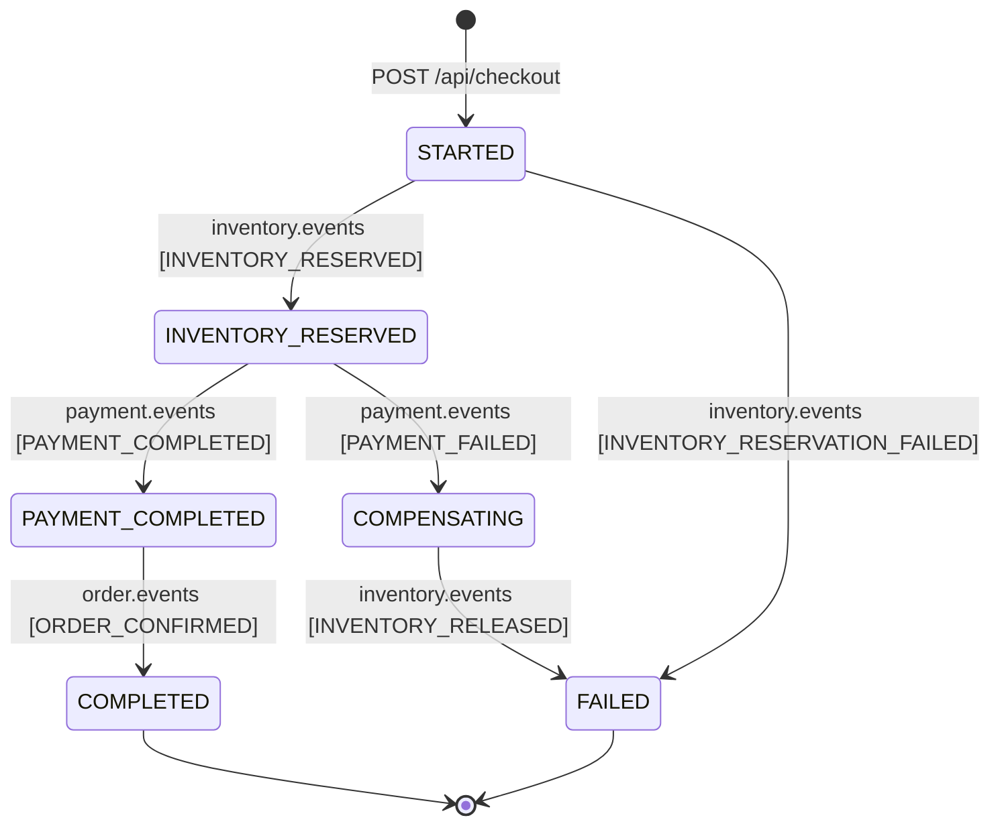

# Saga Pattern & Distributed Transaction Specification

## 1. The Distributed Transaction Challenge

In our microservices architecture, completing an order touches three separate database boundaries:
1. `order_db`: Create order in `PENDING` state.
2. `inventory_db`: Reserve physical stock to prevent double-booking.
3. `payment_db`: Charge the customer's payment method idempotently.

A traditional ACID transaction using Two-Phase Commit (2PC) is rejected because:
- **Lock Contention**: 2PC requires holding distributed locks across all three databases for the entire network roundtrip duration, reducing throughput to single-digit orders per second.
- **Availability Hazard (CAP Theorem)**: If the Payment Gateway or network hangs, all database connections remain blocked.
- **Microservices Isolation**: Modern cloud and third-party payment gateways (Stripe, PayPal, Adyen) do not participate in XA transactions.

---

## 2. Order Orchestrator Saga Architecture

We utilize an **Orchestration-based Saga** hosted within the `Order Service`. The orchestrator maintains the current state in a persistent `saga_instances` table, dispatching asynchronous commands via Kafka events and listening for completion or failure replies.



---

## 3. Saga State Entity & Progression

```sql
CREATE TABLE saga_instances (
    id VARCHAR(36) PRIMARY KEY,
    order_id VARCHAR(36) NOT NULL UNIQUE,
    current_step VARCHAR(50) NOT NULL,
    status VARCHAR(30) NOT NULL, -- STARTED, IN_PROGRESS, COMPLETED, COMPENSATING, FAILED
    error_message TEXT,
    created_at TIMESTAMP WITH TIME ZONE DEFAULT CURRENT_TIMESTAMP,
    updated_at TIMESTAMP WITH TIME ZONE DEFAULT CURRENT_TIMESTAMP
);
```

### Transition Table

| Triggering Event | Current Saga Status | Next Saga Status | Outbox Command Emitted | Target Service |
| :--- | :--- | :--- | :--- | :--- |
| `POST /api/checkout` | `NONE` | `STARTED` | `ORDER_CREATED` | Inventory Service |
| `INVENTORY_RESERVED` | `STARTED` | `IN_PROGRESS` | `PAYMENT_REQUESTED` | Payment Service |
| `INVENTORY_RESERVATION_FAILED`| `STARTED` | `FAILED` | `ORDER_CANCELLED` | Notification Service |
| `PAYMENT_COMPLETED` | `IN_PROGRESS` | `COMPLETED` | `ORDER_CONFIRMED` | Notification & Inventory |
| `PAYMENT_FAILED` | `IN_PROGRESS` | `COMPENSATING` | `INVENTORY_RELEASE_REQUESTED` | Inventory Service |
| `INVENTORY_RELEASED` | `COMPENSATING` | `FAILED` | `ORDER_CANCELLED` | Notification Service |

---

## 4. Compensating Transactions (Semantic Undo)

In distributed systems, a failure cannot be undone with a simple database `ROLLBACK`. Instead, a forward compensating transaction must be executed:
- **Original Action**: `available_quantity = available_quantity - 2`, `reserved_quantity = reserved_quantity + 2`.
- **Compensating Action**: `available_quantity = available_quantity + 2`, `reserved_quantity = reserved_quantity - 2`, mark reservation status as `RELEASED`.
- **Order Cancellation**: Update order status from `PENDING` to `FAILED` or `CANCELLED`.
- **Customer Feedback**: Send notification explaining the reason (e.g., "Payment could not be processed, card declined").
